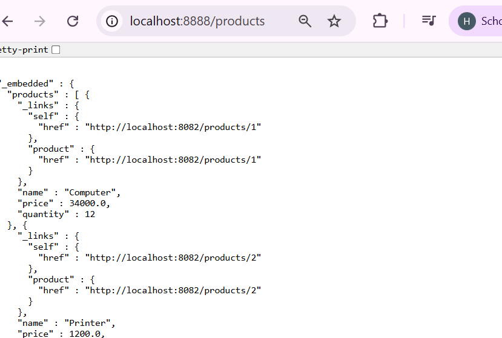
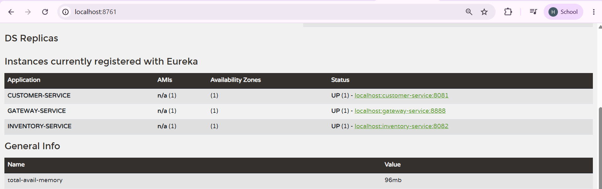
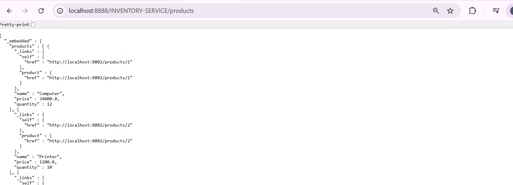
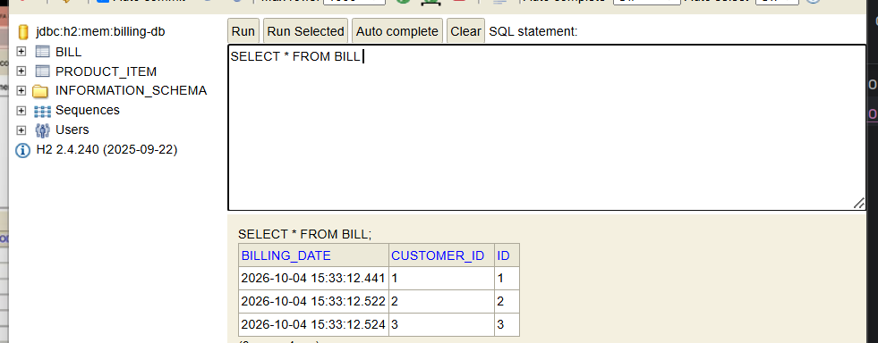
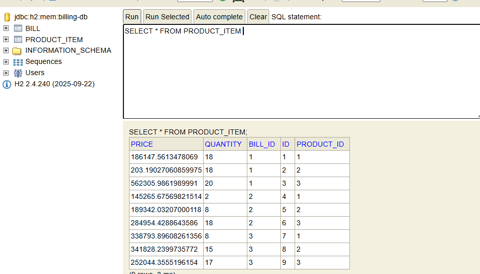
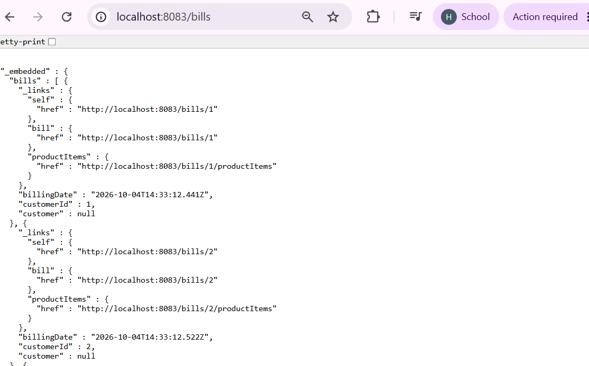
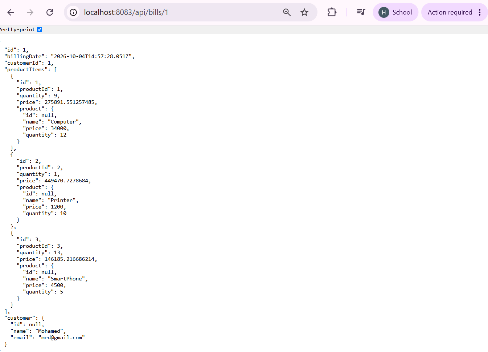
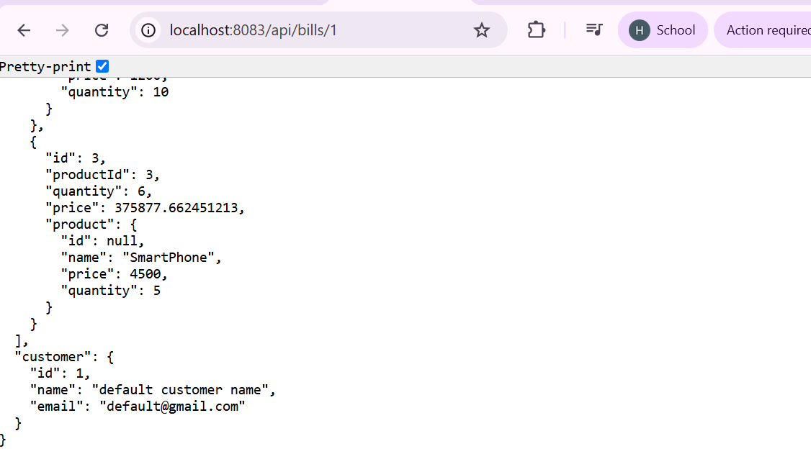
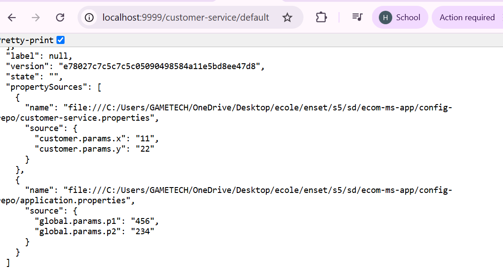

# Application Micro-services de gestion de factures

## Objectif

Créer une application basée sur une **architecture micro-services** permettant de gérer des **factures** contenant des **produits** et appartenant à un **client**.

## Ressources

- [Partie 1](https://www.youtube.com/watch?v=kOVHzN8I8e8)
- [Partie 2](https://www.youtube.com/watch?v=-iM3J_mgqlM)
- [Service de configuration (vidéo)](https://www.youtube.com/watch?v=-G2rcLMO1gQ)
- [Dépôt GitHub de référence](https://github.com/mohamedYoussfi/micro-services-app)


## Architecture

```
                        ┌──────────────────────┐
                        │   Config Service     │
                        │ (config centralisée) │
                        └──────────┬───────────┘
                                   │
 Client ──► Gateway ──► ┌──────────┴───────────┐
          (Spring Cloud │  Discovery Service   │
            Gateway)    │      (Eureka)        │
                        └──────────┬───────────┘
                                   │
          ┌────────────────────────┼────────────────────────┐
          ▼                        ▼                        ▼
  customer-service         inventory-service         billing-service
     (clients)                (produits)         (factures, Open Feign)
                                                   │            │
                                                   └─► appelle ─┘
                                           customer-service & inventory-service
```

## Micro-services

| Service | Rôle |
|---|---|
| **customer-service** | Gestion des clients |
| **inventory-service** | Gestion des produits |
| **gateway-service** | Point d'entrée unique (Spring Cloud Gateway) |
| **discovery-service** | Annuaire Eureka (enregistrement et découverte des services) |
| **billing-service** | Gestion de la facturation, communication via **OpenFeign** |
| **config-service** | Configuration centralisée (Spring Cloud Config, dépôt Git) |

## Technologies

- Java / Spring Boot
- Spring Data JPA, Spring Data REST
- Spring Cloud Gateway
- Spring Cloud Netflix Eureka
- Spring Cloud OpenFeign
- Spring Cloud Config
- Spring Boot Actuator
- Base de données H2
- Lombok, Maven

---

## Travail réalisé

### 1. Micro-service `customer-service`

Gestion des clients (entité, repository, exposition REST) avec premiers tests.


### 2. Micro-service `inventory-service`

Gestion des produits, avec tests des endpoints.


### Actuator

Vérification de l'état de santé et des informations des services via Spring Boot Actuator.


### 3 & 4. Gateway Spring Cloud Gateway + configuration statique du routage

Mise en place de la Gateway et définition manuelle des routes vers les micro-services.



### 5. Annuaire Eureka Discovery Service

Les micro-services s'enregistrent automatiquement auprès d'Eureka.



### 6. Configuration dynamique des routes de la Gateway

Les routes sont générées dynamiquement à partir des services enregistrés dans Eureka (`DiscoveryClientRouteDefinitionLocator`).



### 7. Service de facturation `billing-service` avec OpenFeign

Le billing-service interroge `customer-service` et `inventory-service` grâce à des clients **OpenFeign** pour composer les factures (client + produits).





**Contrôleur REST :**



**Client par défaut (fallback) :**



### 8. Service de configuration (`config-service`)

Centralisation des fichiers de configuration des micro-services dans un dépôt Git.



---

## Lancement du projet

> Respecter cet ordre de démarrage :

1. `config-service`
2. `discovery-service` (Eureka)
3. `customer-service`
4. `inventory-service`
5. `billing-service`
6. `gateway-service`

```bash
# Dans le dossier de chaque service
mvn spring-boot:run
```

### Ports (à adapter selon votre configuration)

| Service | Port |
|---|---|
| config-service | 9999 |
| discovery-service | 8761 |
| customer-service | 8081 |
| inventory-service | 8082 |
| billing-service | 8083 |
| gateway-service | 8888 |

### Exemples d'URL (via la Gateway)

```
GET http://localhost:8888/CUSTOMER-SERVICE/customers
GET http://localhost:8888/INVENTORY-SERVICE/products
GET http://localhost:8888/BILLING-SERVICE/fullBill/1
```

Dashboard Eureka : http://localhost:8761

---

## Structure du projet

```
micro-services-app/
├── config-service/
├── discovery-service/
├── gateway-service/
├── customer-service/
├── inventory-service/
├── billing-service/
└── README.md
```

## Auteur

- ID OUAKSIM Halima II-BDCC-3